# 📄 Planeación del Sistema en Jira

## Desglose de trabajo: Épicas, Historias de Usuario y Tareas

# La implementación de los requerimientos identificados de TechCup se desglosa de la siguiente manera:

### 1. Épica: Gestión de torneos

| ID | Título | Stakeholder | Evidencia en Jira |
|:---:|---|---|---|
| EP-01 | Gestión de torneos | Organizador del torneo | 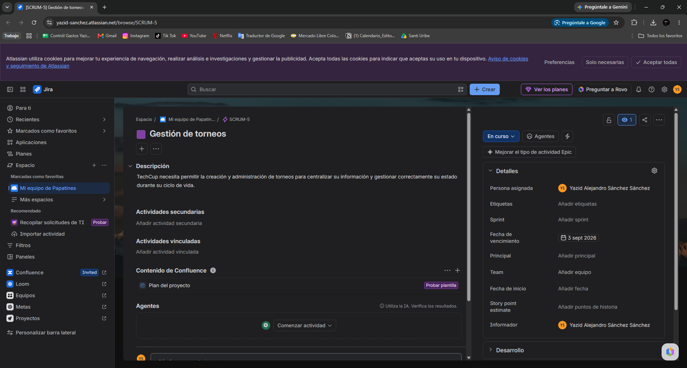 |
--
### 2. Historias de usuario

| ID | Título de la Historia | Captura de Jira |
|:---:|---|---|
| HU-01 | Crear torneo | 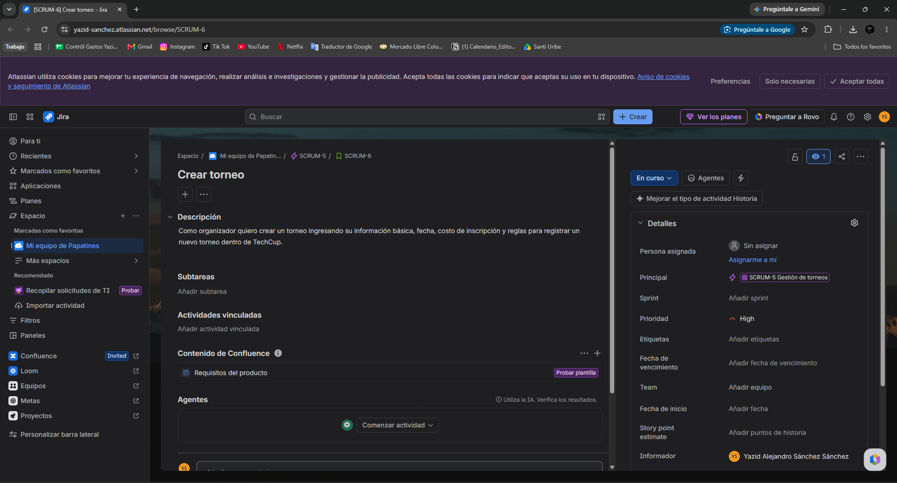 |
| HU-02 | Actualizar información del torneo | 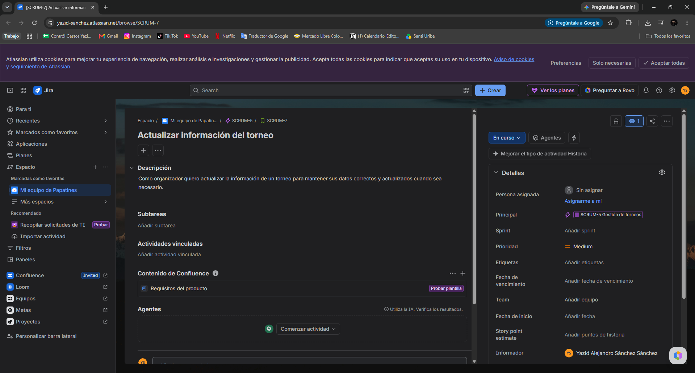 |
| HU-03 | Cambiar estado del torneo | 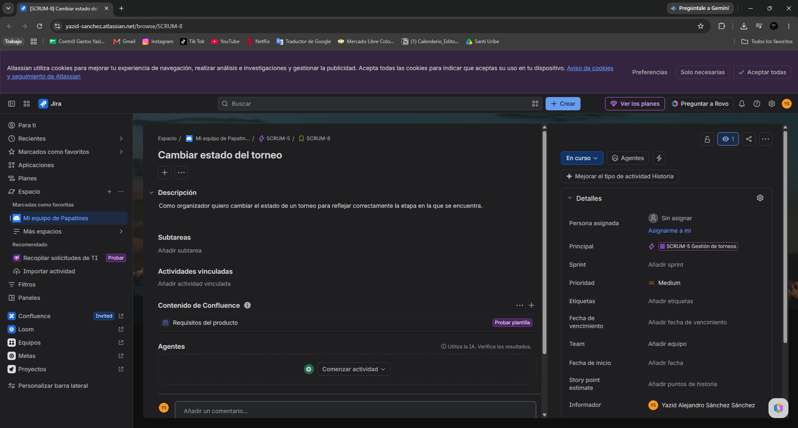 |
| HU-04 | Activar torneo | 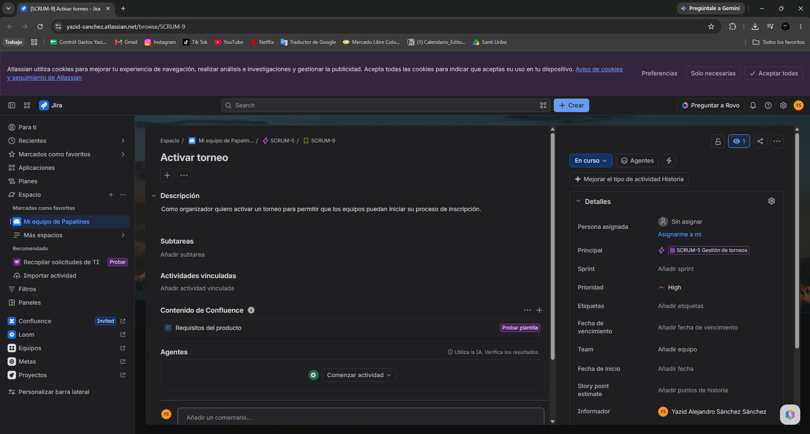 |

### 3. Tareas
| Historia Asociada | ID | Tarea | Captura de Jira |
|:---:|:---:|---|---|
| HU-01 | TR-01 | Crear interfaz de creación de torneo | 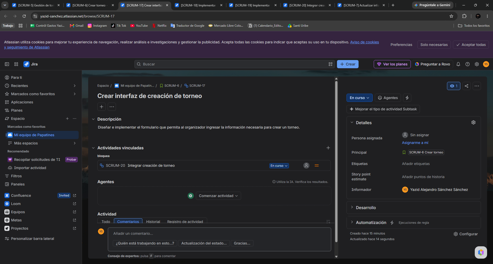 |
| HU-01 | TR-02 | Implementar almacenamiento de torneos | 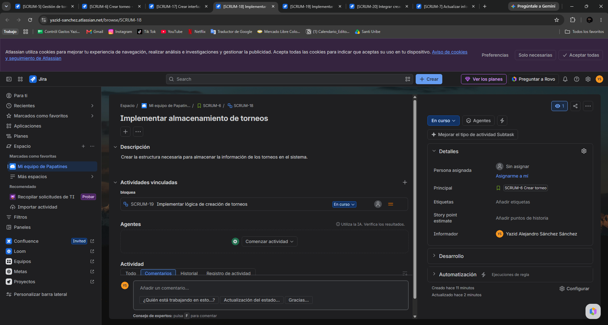 |
| HU-01 | TR-03 | Implementar lógica de creación de torneos | !\[Tarea 3](../images/tarea3.png) |
| HU-01 | TR-04 | Integrar creación de torneo | 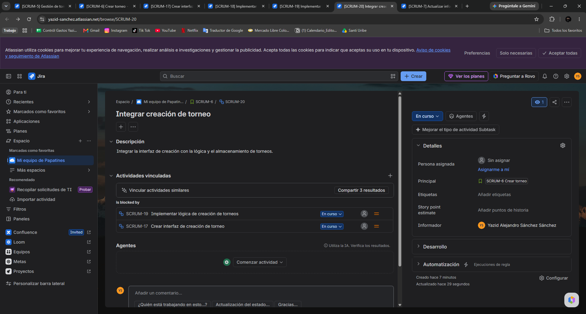 |
| HU-02 | TR-05 | Crear interfaz de edición de torneo | 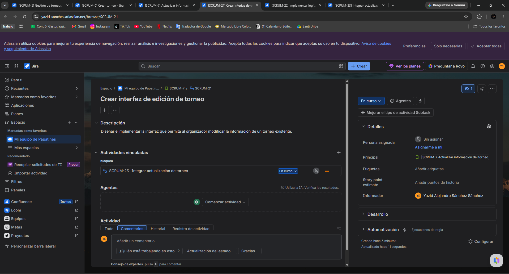 |
| HU-02 | TR-06 | Implementar lógica de actualización | 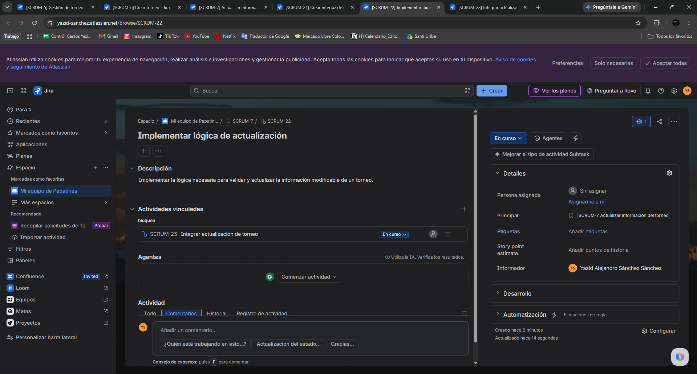 |
| HU-02 | TR-07 | Integrar actualización de torneo | 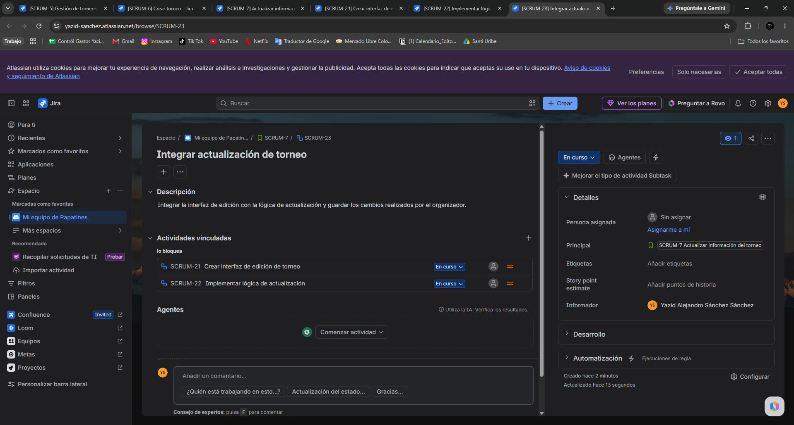 |
| HU-03 | TR-08 | Crear control de cambio de estado | 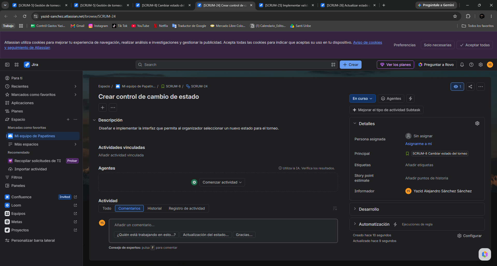 |
| HU-03 | TR-09 | Implementar validación de estados | 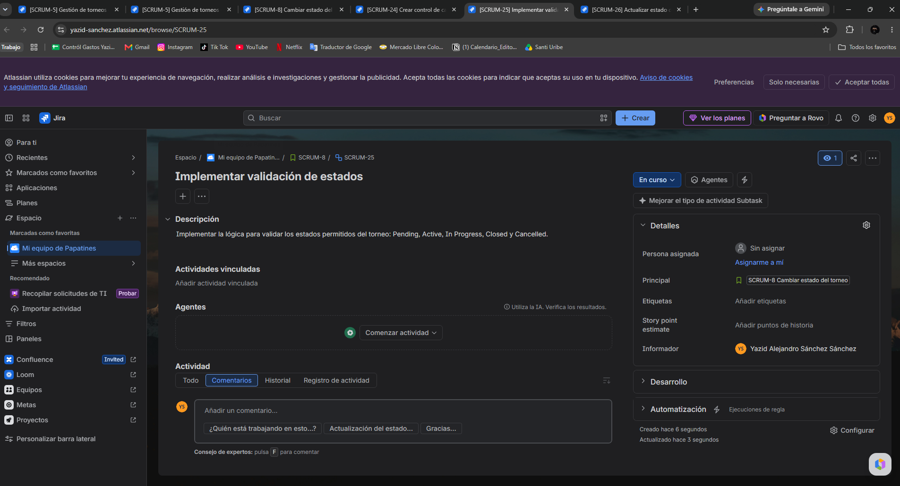 |
| HU-03 | TR-10 | Actualizar estado del torneo | 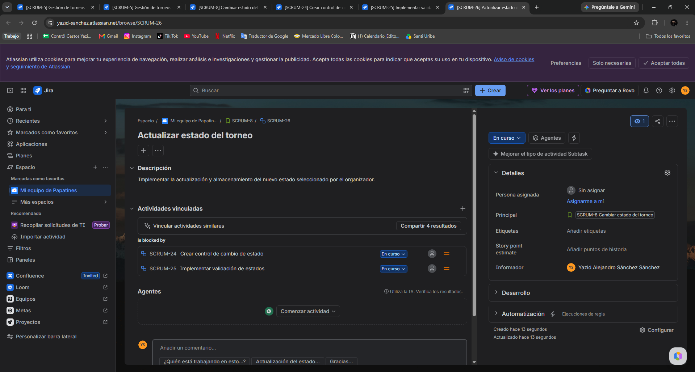 |
| HU-04 | TR-11 | Consultar torneo activo | 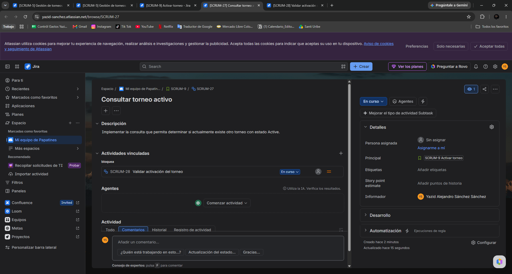 |
| HU-04 | TR-12 | Validar activación del torneo | 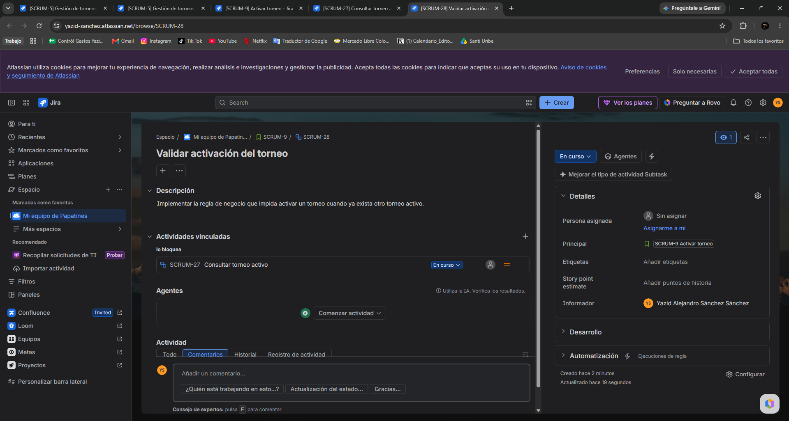 |

#### 4. Cronograma

# 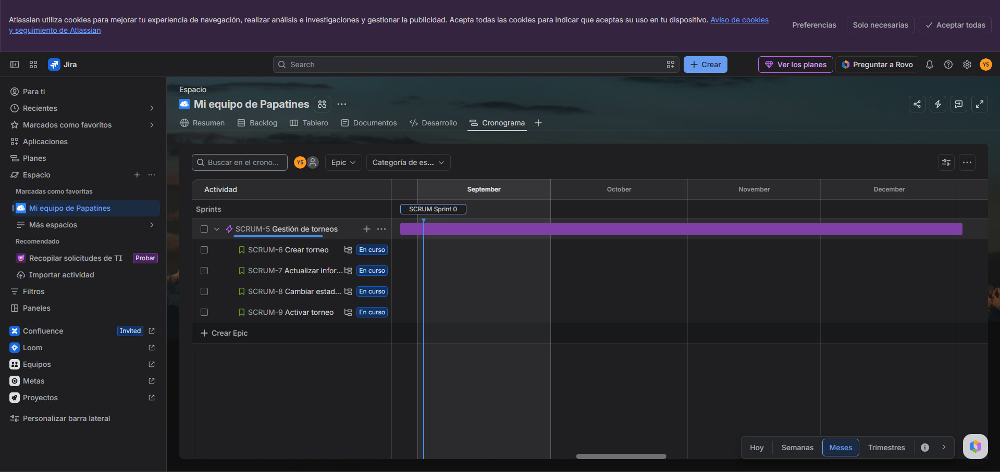

### 5. Backlog

# 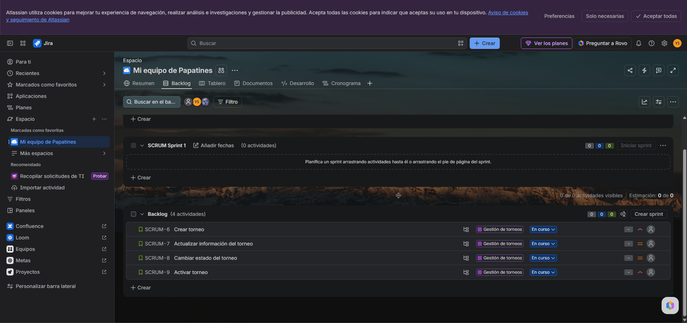

